# AI Tarot

**Quiet the mind, write your question, shuffle, and draw — let the reading surface.**

| | |
|---|---|
| Role | Solo full-stack: product, visual design, frontend, backend, LLM interpretation |
| Type | Bilingual AI tarot reading web app (MVP) |
| Stack | Next.js 16 · React 19 · FastAPI · Postgres / Supabase · Gemini · SSE |
| Live | {{LIVE_URL}} |

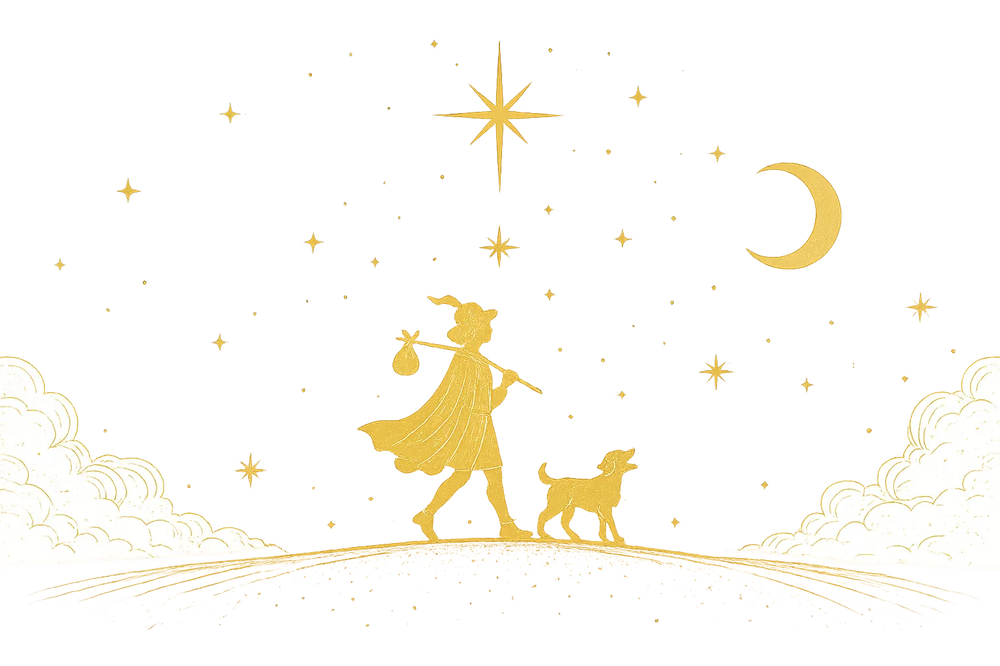

---

## What it is

AI Tarot is not a chat box that dumps a reading after a form submit. It treats a reading as a short ritual: write a question, pick a spread and tone, shuffle, draw by feel, then watch the interpretation arrive card by card.

The UI defaults to Traditional Chinese and also speaks English. Themes are Midnight Velvet (dark) and Moonlit desk (light). There are no accounts — you can read immediately.

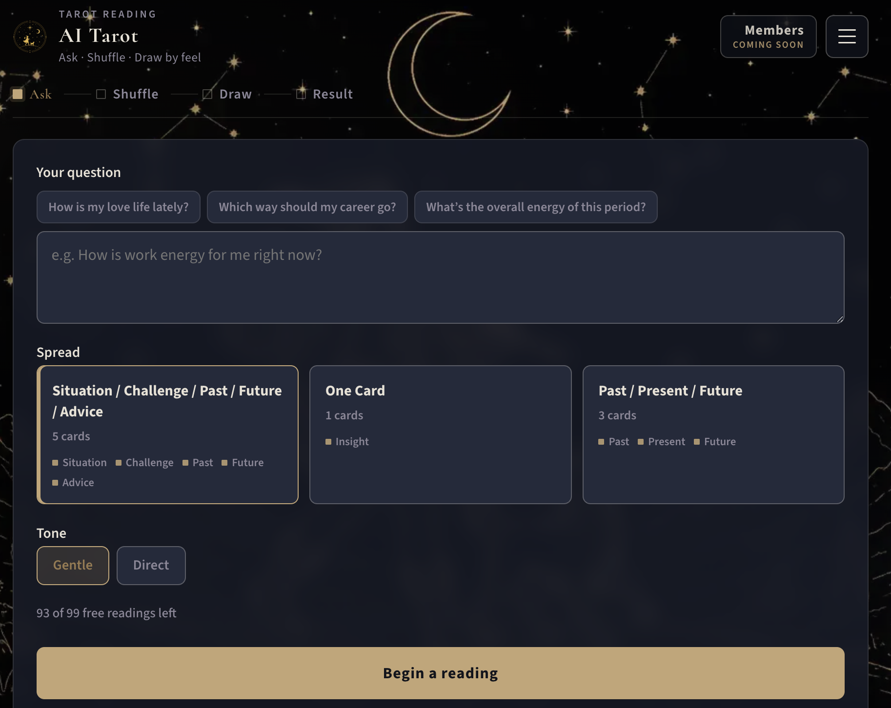

---

## Problem

Most AI tarot products share one shape: form, submit, wall of text. The bodily act of drawing disappears. The model often “draws” the cards, so the user becomes a spectator. Bilingual support is usually an afterthought. The voice is either carnival fortune-telling or a verdict dressed as insight.

The bet was the opposite:

- **The user draws; the model interprets.** Randomness and intuition stay in the browser. Gemini never picks cards.
- **The voice should sound like a person**, gentle or direct, without declaring fate or deciding for the user.
- **zh-Hant and English are first-class** — UI strings and LLM prompts are authored separately, not machine-translated at request time.

---

## Goals

One path, end to end:

**Ask → clarify / reframe when needed → confirm → shuffle → draw by feel → stream the interpretation over SSE → follow up.**

Spreads today: One Card; Past / Present / Future; Situation / Challenge / Past / Future / Advice. Tones: gentle or direct. Up to four follow-ups per session, with an optional clarifying Major Arcana.

---

## Experience

The home page is a brand mark (“Tarot Reading”), the title AI Tarot, a single subtitle, and a CTA. The reading page’s rhythm is **Ask · Shuffle · Draw by feel**.

Moments that are load-bearing, not decoration:

- **Fool’s Journey backdrop** — moon/stars at night, sunlit desk by day; desktop 16:9 and mobile 9:16 art so the traveler isn’t cropped by notches or home indicators.
- **Mahjong-style shuffle** — a ~2.5s deterministic scatter-and-return. Ritual, not a spinner.
- **Fan draw** — horizontal drag, pick by feel, or “draw for me,” with undo. Reversals are a client-side coin flip (~50%).
- **Flip + stream** — SSE delivers JSON sections as they complete; matching cards rotate in 3D; a cursor blinks at the end of the growing text.

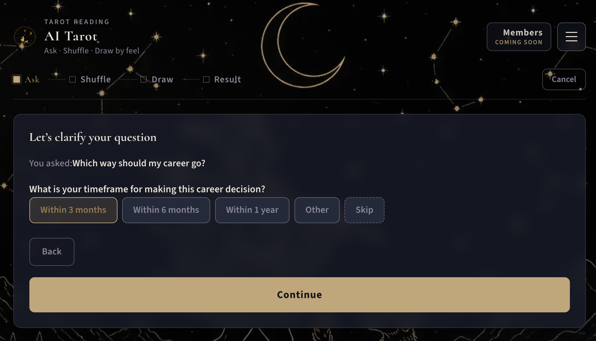

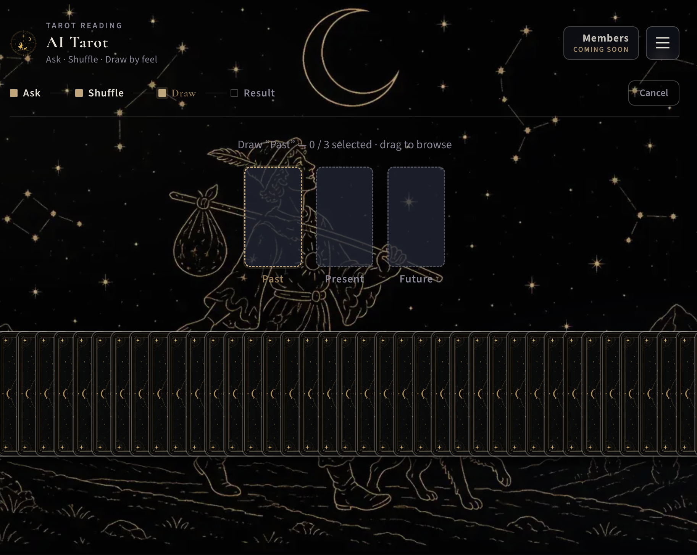

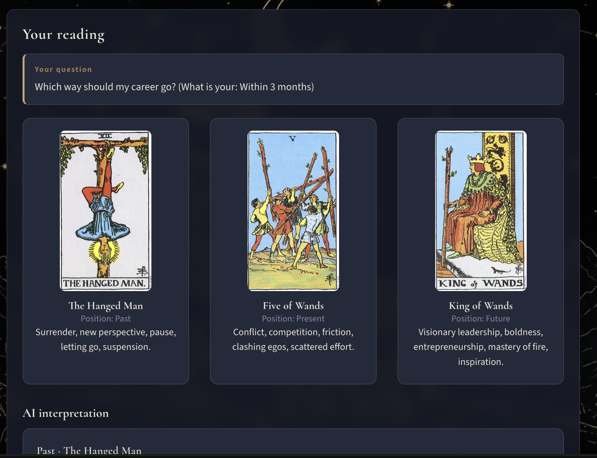

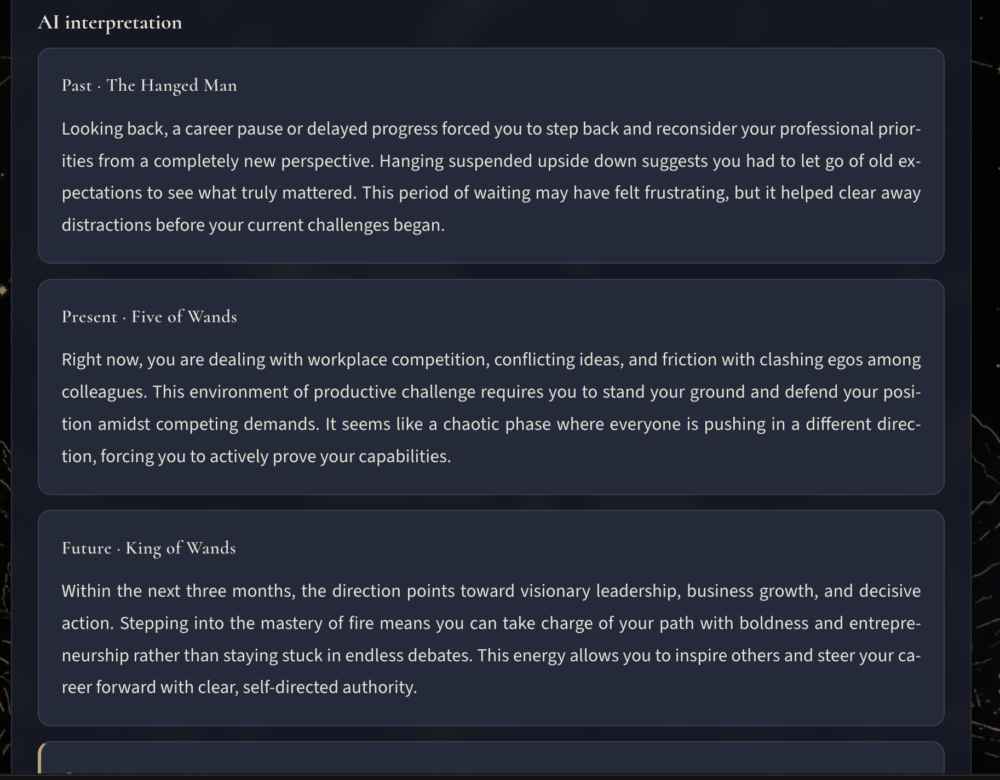

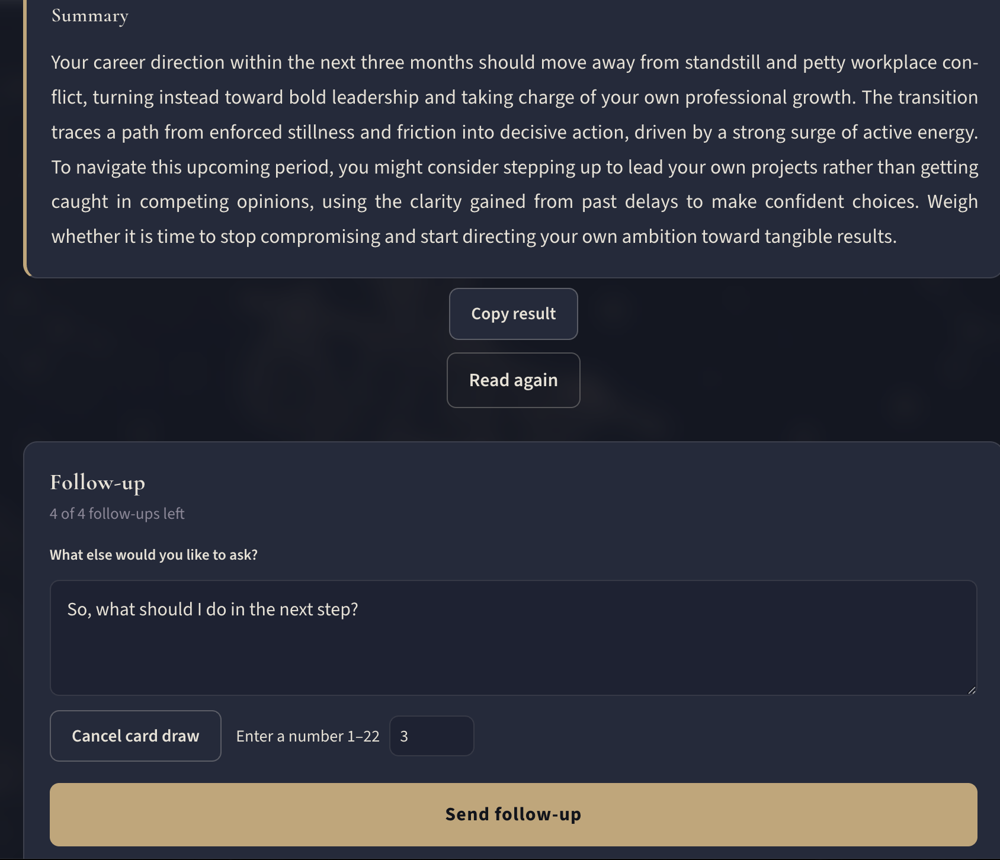

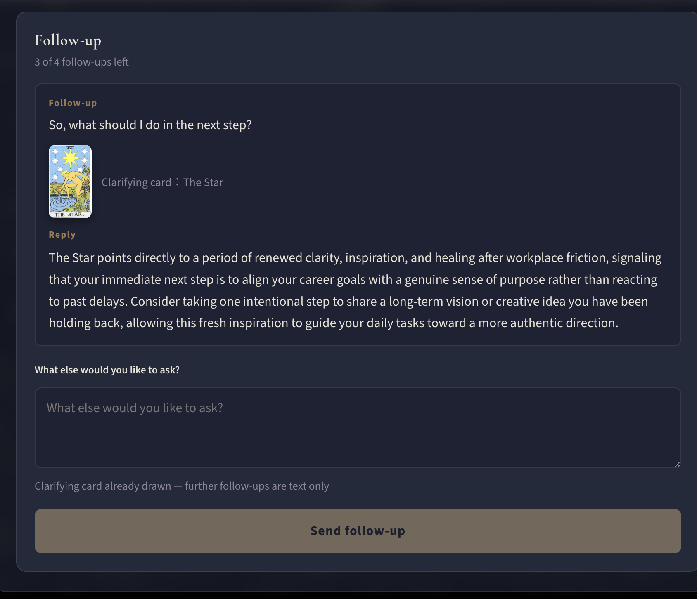

Before the shuffle, the backend classifies the question (love / career / spiritual / mood / general), may ask up to two clarifying questions, and may offer one gentle reframe. Decision-outsourcing, other-focused, over-long, or vague questions get pulled back toward what the user can observe or do. Health and crisis advisories remind without blocking.

---

## Architecture

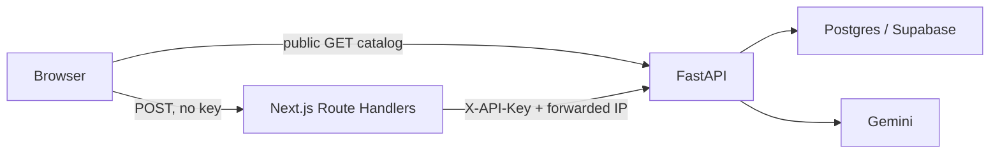

The browser GETs decks, cards, and spreads directly. Anything that spends LLM budget (question analysis, readings, follow-ups) goes through a Next.js BFF. `TAROT_API_KEY` is server-only — never `NEXT_PUBLIC_`, never in the client bundle.

FastAPI packs card meanings, elements, numerology, and semantic tags from Postgres into the prompt (**context packing, not RAG**), asks Gemini for structured JSON, and streams it back. Production disables `/docs`, `/redoc`, and `/openapi.json`. LLM routes are rate-limited per client IP; the frontend enforces a free-reading quota with an HMAC-signed HttpOnly cookie.

---

## Technical notes

Useful in interviews. Keep LinkedIn copy light; point here for depth.

### Stack

| Layer | Choice |
|---|---|
| Frontend | Next.js 16 App Router, React 19, CSS Modules, Framer Motion, Vitest |
| Backend | Python 3.12, FastAPI, SQLAlchemy 2, Alembic, Pydantic v2, slowapi |
| Data | Postgres (Supabase); card art as public Supabase Storage URLs |
| LLM | `google-genai`; model from `LLM_MODEL` (typically `gemini-3.5-flash-lite`) |
| Deploy | Frontend on Vercel; backend container (Railway / Render / Fly) |
| CI | Vitest, pytest, gitleaks, pip-audit, npm audit |

Not used: embeddings, vector DB, RAG, OpenAI, few-shot examples, AI-generated card art.

### Request path for one reading

1. `POST /questions/analyze` — classify, clarify, optional reframe / advisory; JSON.
2. Browser shuffles and draws (LLM does not participate).
3. `POST /readings/stream` — persist session, one-line core question, pack prompt from DB, call Gemini, SSE `cards[]` + `summary`.
4. `POST /readings/{id}/follow-ups` — answer against the prior summary; optional clarifying card. Max four.

Public `GET`s: `/decks`, `/cards`, `/spreads`. Mutations require `X-API-Key`, attached only by Next.js Route Handlers.

### Prompt pipeline

Templates in `interpretation.yaml`, zh and en. Python fills the user body; the question is not concatenated into the system prompt as instructions.

| Family | Role | Output |
|---|---|---|
| `question_analysis` | Type, up to two clarifiers, optional reframe / advisory | JSON |
| `core_question` | One-sentence intent; no invented background | Plain text |
| `interpretation` | Tone-aware reading; question treated as data (injection fence); each position answers the question | JSON: `cards` + `summary` |
| `follow_up` | This follow-up only; no full re-read | JSON: `{"answer"}` |

Assembled user prompt: spread / topic / question / core question → element and number synthesis → drawn cards (meanings, keywords, tags) → tag echoes and tensions → JSON footer and writing rules.

Guardrail: regex for assertive / fatalistic phrasing, then one rewrite retry. Sync path also retries on truncation.

### Schema (split by concern)

| Table | Holds |
|---|---|
| `decks` | Deck identity (`slug` public, UUID internal) |
| `cards` | Card identity (no meanings) |
| `card_contents` | One row per language: meanings, keywords, SEO fields |
| `card_metadata` | Element, zodiac, numerology, semantic tags (1:1 with cards) |
| `spreads` | Name + `positions` JSONB |
| `readings` / `reading_cards` | Session and per-position draws (incl. reversed) |

Spreads are data-driven; the UI does not hard-code position names. The shape is ready for more decks and encyclopedia pages; those surfaces are not built.

### Frontend and safety

- Reading page is CSR. Concerns split across hooks (deck, picking, submit, clarify), composed in `useReadingFlow`.
- User-facing copy goes through i18n (`zh-Hant` / `en`); no bare strings in JSX.
- LLM routes: `20/minute;500/day`, keyed on the first `X-Forwarded-For` hop because traffic is proxied.
- Free quota is an HMAC-signed HttpOnly cookie in the Next.js proxy, not a FastAPI users table.
- Auth today is a shared API key. No `user_id`. Membership and payments wait on real per-user auth.

### Eval (opt-in, not production)

Nine cases (1 / 3 / 5 cards × three draw strategies). Layer 1: meaning and structure (orientation, position logic, cohesion). Layer 2: fabricated facts and inner-state assertions. Layer 3: a second Gemini call as LLM-as-judge. Used to iterate prompts, not as a live quality dashboard.

---

## Engineering decisions

**Prompts are product spec.** YAML families — `question_analysis`, `core_question`, `interpretation`, `follow_up` — each in zh and en. The user question is data, not instructions (prompt-injection fence). Every card must speak to the question; the summary synthesizes and does not re-read; unstated motives stay tentative. No invented card names, no fated outcomes.

**The model does not draw.** Shuffle and selection happen in the browser. That is both a product belief and a safety boundary: the model may talk about the spread; it may not rewrite how the spread arrived.

**Guardrails.** A regex pass catches assertive / fatalistic phrasing and triggers one rewrite retry. This constrains the model, not the user.

**Eval is an opt-in harness, not a unit-test suite.** Nine cases (1 / 3 / 5 cards × three draw strategies). Layer 1 checks meaning and structure; layer 2 checks fabricated facts and inner-state assertions; layer 3 is an LLM-as-judge rubric. Used to iterate prompts. Not presented as a live quality dashboard.

**Schema split by concern.** Card identity, per-language content, esoteric metadata, and data-driven spreads (JSONB) are separate tables. Public routes use slugs; FKs use UUIDs. The shape is ready for more decks and encyclopedia pages; those surfaces are not built yet.

**Security matches the current auth model.** Shared API key + rate limits. No `user_id`. CI runs gitleaks, pip-audit, and npm audit. Payments and membership wait on real per-user auth — the UI already says “Members / Coming soon.”

---

## Design

There is no brand-guidelines PDF. The identity lives in tokens and type.

| | Midnight Velvet (dark) | Moonlit desk (light) |
|---|---|---|
| Atmosphere | Western occult desk, night cloth | Cold ivory, indigo ink, antique brass |
| Accent | Brass `#c4a574` | Antique brass `#8b7355` |

Display: Cormorant. Body: Source Sans 3. CJK display / body: Noto Serif TC / Noto Sans TC. Panels are frosted glass. CTAs fill brass and outline on hover. The mark is the Fool and the dog in a circle.

Ritual comes from pacing and empty space, not from stacking symbols. `prefers-reduced-motion` is respected.

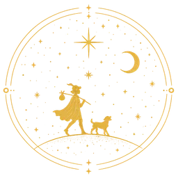

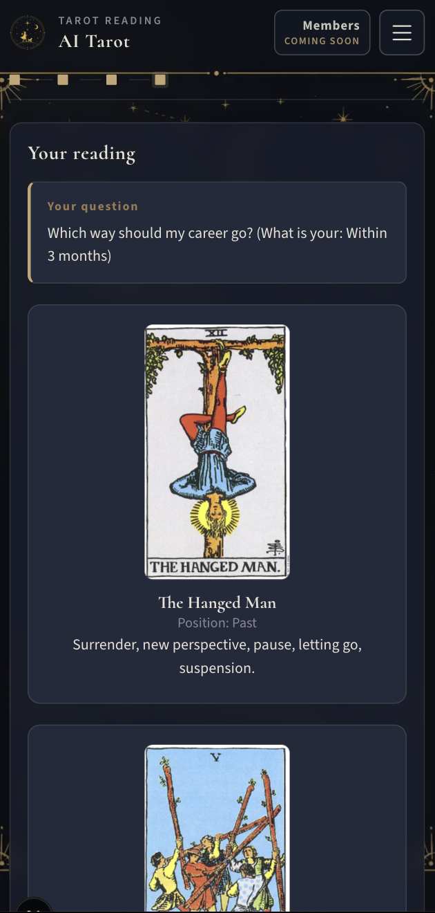

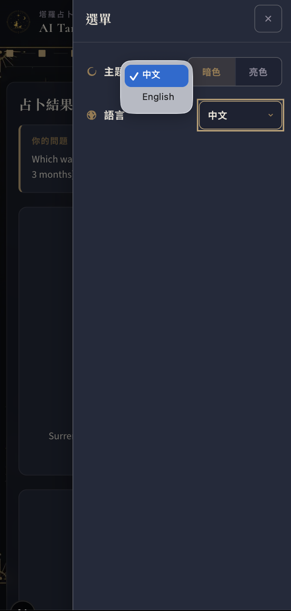

---

## Constraints and next

This is an MVP that completes a reading, not a platform.

Not built: per-user accounts, payments, tarot encyclopedia SEO pages, additional decks as first-class UI. The free quota lives in the Next.js proxy, not a users table. That order is intentional.

If the work continues: real auth and ownership, rereadable history, encyclopedia pages on the same `card_contents` rows, and folding the eval axes that keep failing back into prompt regressions.

---

## One line

**AI Tarot is a shippable bilingual reading ritual: the user draws, the model only interprets, and the interpretation surfaces over a stream — backed by FastAPI, Postgres, and prompts that refuse to declare fate.**
